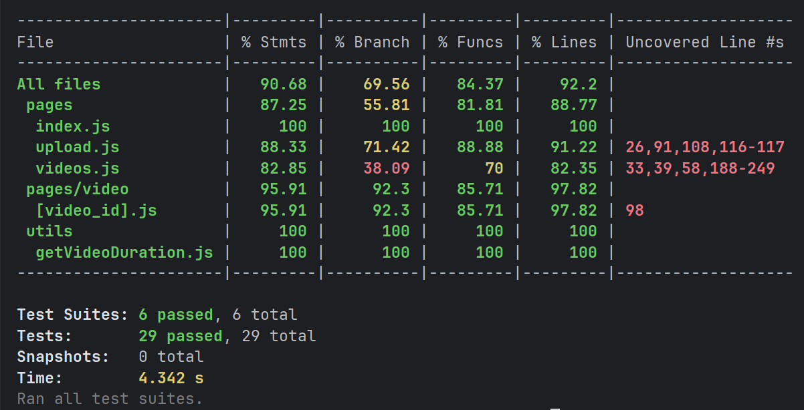

# mazy-video-tools-frontend

[](https://sonarcloud.io/summary/new_code?id=MAZY-Tech_mazy-video-tools-frontend)
[](https://sonarcloud.io/summary/new_code?id=MAZY-Tech_mazy-video-tools-frontend)
[](https://sonarcloud.io/summary/new_code?id=MAZY-Tech_mazy-video-tools-frontend)


Projeto de ferramentas de processamento de vídeo desenvolvido no curso de Pós-Graduação em Arquitetura de Software na Pós-Tech FIAP. Frontend construído com Next.js.

---

## Sumário

1. [Sobre o Projeto](#sobre-o-projeto)
2. [Qualidade do código](#qualidade-do-código)
3. [Tecnologias Utilizadas](#tecnologias-utilizadas)
4. [Pré-requisitos](#pré-requisitos)
5. [Como Executar Localmente](#como-executar-localmente)
6. [Participantes](#participantes)

---

## Sobre o Projeto

O **mazy-video-tools-frontend** é uma aplicação web desenvolvida em **Next.js**, um framework React para renderização do lado do servidor (SSR) e geração de sites estáticos (SSG). Este projeto tem como objetivo oferecer uma interface de usuário moderna e responsiva para a ferramenta de processamento de vídeos, proporcionando uma experiência fluida e intuitiva para os usuários.

---

## Qualidade do Código

### Testes unitários


### SonarQube


### Cobertura de Testes


---


## Tecnologias Utilizadas

- **Next.js**: Framework React para renderização do lado do servidor (SSR) e geração de sites estáticos (SSG).
- **React**: Biblioteca JavaScript para construção de interfaces de usuário.
- **Next Auth**: Solução de autenticação para aplicações Next.js.
- **Jest & Testing Library**: Ferramentas para testes unitários e de integração.
- **Docker**: Ferramenta de containerização para garantir a portabilidade e consistência do ambiente.
- **CI/CD**: Integração e entrega contínua para automação do processo de desenvolvimento.

---

## Pré-requisitos

Antes de começar, certifique-se de ter as seguintes ferramentas instaladas em seu ambiente:

- **Node.js**: Versão 16.x ou superior.
- **npm** ou **yarn**: Gerenciador de pacotes para instalar as dependências.
- **Git**: Para clonar o repositório.
- **Docker**: Para construir as imagens da aplicação (opcional para desenvolvimento local).

---

## Como Executar Localmente

### Desenvolvimento Local

1. Clone o repositório:
   ```bash
   git clone https://github.com/seu-usuario/mazy-video-tools-frontend.git
   cd mazy-video-tools-frontend
   ```

2. Instale as dependências:
   ```bash
   npm install
   # ou
   yarn
   ```

3. Configure as variáveis de ambiente:
   - Copie o arquivo `.env.example` para `.env.local`
   - Ajuste as variáveis conforme necessário

4. Execute o servidor de desenvolvimento:
   ```bash
   npm run dev
   # ou
   yarn dev
   ```

5. Acesse a aplicação em `http://localhost:3000`

### Usando Docker

1. Construa a imagem Docker:
   ```bash
   docker build -t mazy-video-tools-frontend .
   ```

2. Execute o container:
   ```bash
   docker run -p 3000:3000 mazy-video-tools-frontend
   ```

3. Acesse a aplicação em `http://localhost:3000`

### Testes

Para executar os testes:
```bash
npm test
# ou
yarn test
```

Para executar os testes em modo de observação:
```bash
npm run test:watch
# ou
yarn test:watch
```


---

## Participantes

- **Alison Israel - RM358367**  
  *Discord*: @taykarus | E-mail: taykarus@gmail.com

- **José Matheus de Oliveira - RM358854**  
  *Discord*: @jsmatheus | E-mail: matheusoliveira.info@gmail.com

- **Victor Zaniquelli - RM358533**  
  *Discord*: @zaniquelli | E-mail: zaniquelli@outlook.com.br

- **Yan Gianini - RM358368**  
  *Discord*: @.gianini | E-mail: yangianini@gmail.com
